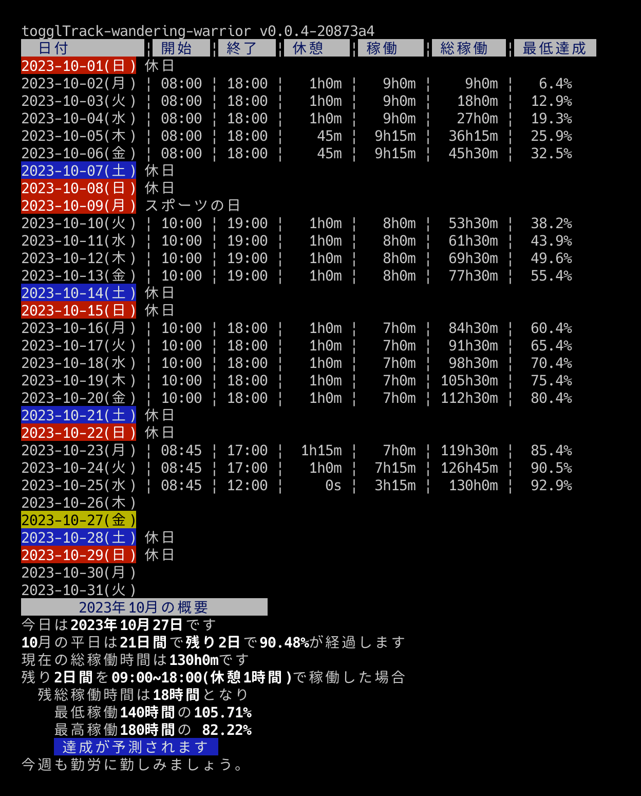

# togglTrack-wandering-warrior

非常に便利なタスク記録ツール[toggl track](https://track.toggl.com/)から月次のいい感じの作業レポートを表示します

* 1日の最初のプロジェクトの開始時刻を始業時間とし、1日の最後のプロジェクトの作業終了時刻をを終業時刻とします。
* その間のプロジェクトの無い時間は休憩時間とします
* [toggl track](https://track.toggl.com/)の特定のWorkspaceの作業時間を集計します
* プロジェクトやクライアントなどは考慮しません
* 最低稼働時間・最高稼働時間を設定することができ、達成率と残時間を表示できます。
* 国民の休日を設定できます

## 初期設定

macOS Apple Silicon

    $ curl -Lo togglTrack-wandering-warrior https://github.com/mamemomonga/togglTrack-wandering-warrior/releases/latest/download/togglTrack-wandering-warrior-darwin-arm64

macOS Intel

    $ curl -Lo togglTrack-wandering-warrior https://github.com/mamemomonga/togglTrack-wandering-warrior/releases/latest/download/togglTrack-wandering-warrior-darwin-amd64

共通

    $ chmod 755 togglTrack-wandering-warrior

* [config.example.yaml](./config.example.yaml)を参考に、config.yamlを作成してください。

## 利用方法

今月のレポート    

    $ ./toggl-wandering-warrior -config ./config.yaml

前月のレポート

    $ ./toggl-wandering-warrior -config ./config.yaml -month 1

# License

MIT
